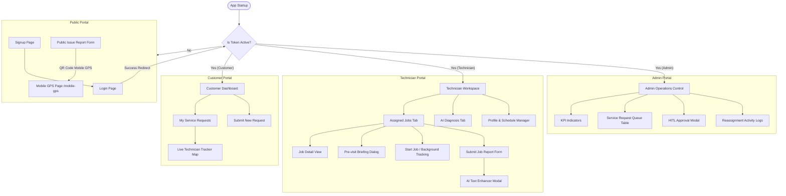
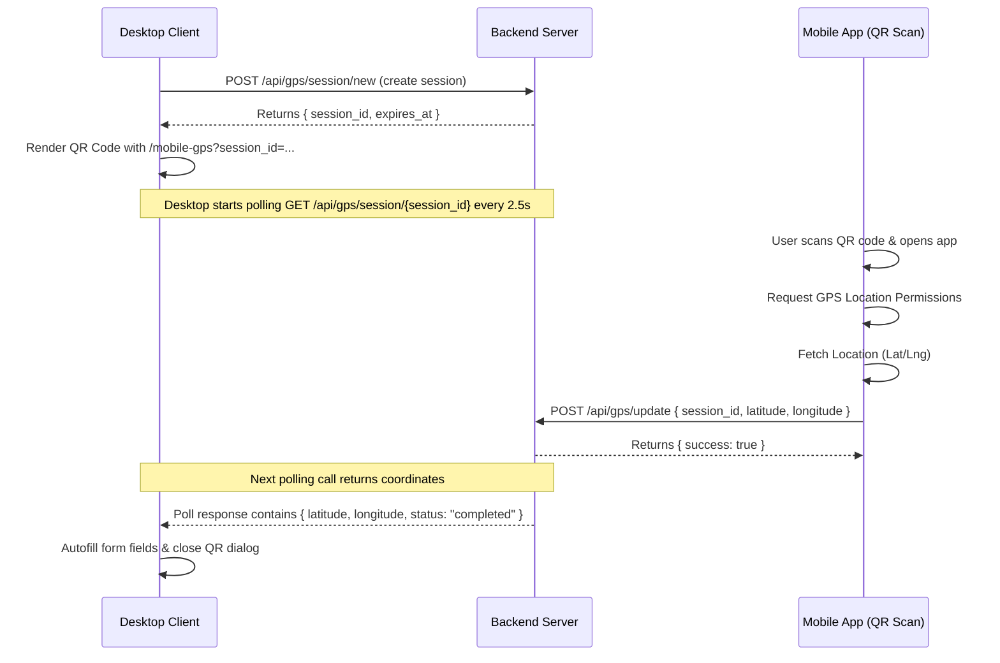

# AI-Powered Field Service Dispatcher v2 - Comprehensive Android Migration Blueprint

This document serves as the architectural specification, design mapping, API contract, and migration strategy for rebuilding the React-based **AI-Powered Field Service Dispatch System** frontend as a native Android application.

It contains all the details necessary for an Android developer or an AI assistant (such as Android Studio / AI Studio) to build the entire app from scratch without reading the original React codebase.

---

## 1. Application Structure & Navigation Flow

### High-Level Architectural Flow
The React app uses a role-based access model with three distinct portals: **Customer**, **Technician**, and **Admin**, as well as public workflows for issue submission, authorization, and standalone mobile GPS synchronization.



### Page / Screen Inventory & Access Matrix

| React Route | Screen Name | Access Level | Description | Primary Interfacing APIs |
| :--- | :--- | :--- | :--- | :--- |
| `/` | `Dashboard.jsx` | Public / Guest | Form to submit service requests with image upload, description, and GPS bridge. | `POST /diagnose`, `POST /customer/report-issue`, `POST /api/gps/session/new` |
| `/login` | `LoginPage.jsx` | Public | Auth gateway for all roles. | `POST /auth/login` |
| `/signup` | `SignupPage.jsx` | Public | Signup form supporting Customer/Technician/Admin profiles. | `POST /auth/signup` |
| `/mobile-gps` | `MobileGPSPage.jsx` | Public | Standalone QR-scanned GPS transmission page. | `POST /api/gps/update`, `GET /api/gps/session/:sessionId` |
| `/customer` | `CustomerDashboard.jsx` | Customer | Track submission status and technician dispatch on map. | `GET /customer/my-requests`, `GET /customer/track/:id` |
| `/technician` | `TechnicianDashboard.jsx` | Technician | Main workflow engine for jobs, AI-assisted pre-visits, and reports. | `GET /technician/jobs`, `POST /technician/jobs/:id/start`, `POST /technician/submit-report` |
| `/technician/profile` | `TechnicianProfilePage.jsx` | Technician | Set core capabilities (skills) and availability windows. | `GET /technician/profile`, `PUT /technician/update-skills` |
| `/admin` | `AdminDashboard.jsx` | Admin | Real-time operations board with SLA alerts, KPIs, and AI dispatch review. | `GET /admin/service-requests`, `POST /admin/service-requests/:id/review` |
| `/admin/activity` | `AdminActivityPage.jsx` | Admin | Review logs and approve/reject technician reassignment requests. | `GET /admin/reassignment-activity`, `POST /admin/reassignment-decision` |

---

## 2. Screen-by-Screen Deep Dive

### 2.1 Public Service Request Form (`Dashboard.jsx`)
* **Screen Purpose**: Enable guests or logged-in customers to submit faulty appliance tickets. Employs a multi-step design: diagnosis preview $\rightarrow$ ticket details $\rightarrow$ dispatch check.
* **Compose Layout Hierarchy**: 
  - `Scaffold` with Scrollable Column.
  - Image Drag & Drop Card (`Card` with `Box` wrapper).
  - Form Fields (`Column` containing standard text outlines).
  - Mobile GPS Sync Dialog (`AlertDialog` containing QR code representation).
* **Forms & Fields**:
  - `Customer Name`: Required, 2-60 chars, pattern: `^[a-zA-Z\s'-]+$`
  - `Email Address`: Required, standard email validation.
  - `Phone Number`: Required, pattern: `^(\+91)?\d{10}$`
  - `Issue Description`: Required, minimum 10 characters.
  - `Location Coordinates`: Lat/Lng fields (Read-only, populated by GPS button or QR Session).
  - `Manual Location`: `City`, `State`, `Pincode` (6 digits) - Mutually exclusive with strict Lat/Lng coordinates.
  - `Uploaded Photo File`: PNG/JPG only, size constraint $\le 10$ MB.
* **Modals / Dialogs**:
  - *Mobile GPS Dialog*: Displayed when clicking "Capture Location via Mobile GPS". Generates and renders a QR code embedding the URL `{BaseWebUrl}/mobile-gps?session_id={sessionId}`. Performs polling (`GET /api/gps/session/{sessionId}`) every 2.5 seconds to await coordinate synchronization.
  - *AI Diagnosis Modal*: Displays intermediate evaluation data (Fault Type, Severity, Confidence score, Recommended Technician Profile) generated from the file upload. Contains "Proceed with Dispatch" button.
* **State Management**:
  - `imageUri`: Local state holding thumbnail preview.
  - `gpsSessionId`: Holds active polling session identity.
  - `isPolling`: Disables background trigger handlers during active sync calls.
  - `diagnosisResult`: Holds transient AI assessment outputs before final form submission.

### 2.2 Mobile GPS Capture Screen (`MobileGPSPage.jsx`)
* **Screen Purpose**: A standalone page that loads when a customer scans the GPS QR Code with their mobile device. Grabs local device coordinates and transmits them back to the desktop form.
* **Compose Layout Hierarchy**:
  - Centered `Box` with circular status animations.
  - Large status text headers.
  - Location permission requesting button / indicator.
* **State Management**:
  - `gpsSessionId` (extracted from deep-link/navigation intent).
  - `status`: `CONNECTING`, `ACQUIRING_PERMISSION`, `SENDING`, `SUCCESS`, `ERROR`.
  - `errorMsg`: String containing detailed error descriptions.
* **Device Access Required**: Fine Location Access permissions (`ACCESS_FINE_LOCATION`, `ACCESS_COARSE_LOCATION`).

### 2.3 Authentication Screens (`LoginPage.jsx` / `SignupPage.jsx`)
* **Screen Purpose**: Collect credentials to authenticate and authorize users into role-specific portals.
* **Compose Layout Hierarchy**:
  - Card-styled `Box` floating over gradient backgrounds.
  - `TextField` with trailing toggle icon for Password visibility.
  - Role Segmented Selection Buttons (for Signup: `Customer`, `Technician`, `Admin`).
* **Validation Rules**:
  - Password: Minimum 8 characters, containing $\ge 1$ upper case, $\ge 1$ lower case, $\ge 1$ number.
  - Sign Up Code requirement: Re-assigns roles based on specific registration sequences.
* **Authentication Storage**: Reroutes to role landing view after capturing and persistence of JSON Web Token.

### 2.4 Customer Dashboard (`CustomerDashboard.jsx`)
* **Screen Purpose**: Portal for customers to monitor active service requests, track arriving technicians, and view completed jobs history.
* **Compose Layout Hierarchy**:
  - Header with Greeting & Log out action.
  - Multi-tab View: `Active Requests`, `Past History`.
  - Nested card listings representing service requests.
* **Data Display & Interactive Modals**:
  - *Service Request Details Modal*: Displays full details, including uploaded diagnosis image, assigned technician name, operational priority status, and ETA.
  - *Technician Live Tracking Map Modal*: Active when the assigned job status becomes `in_progress`. Displays an interactive map containing:
    - Customer Location (Marker A)
    - Technician Live Position (Marker B)
    - Dynamic route mapping between coordinates.
    - Status card showing estimated arrival time and distance.
* **State Management**: SWR simulation cache syncing automatically every 5 seconds on active tracking maps.

### 2.5 Technician Workspace (`TechnicianDashboard.jsx`)
* **Screen Purpose**: The heavy operational interface for field service agents. Renders job queues, route optimization, AI pre-visit checklists, and completion reports.
* **Compose Layout Hierarchy**:
  - Sticky Top Bar containing Profile linking indicator and current status indicator.
  - Tab layouts: `Assigned Jobs`, `AI Diagnosis`.
  - Expanding layout items representing individual jobs.
* **Specific Modals**:
  - *Pre-visit Report Modal*: Loads AI-generated checklists of parts, tools, and actions needed. Handles timeouts and manual fallbacks gracefully.
  - *Submit Job Report Modal*: Renders input parameters split into sections:
    - *Section A*: Service Details (Read-only context details).
    - *Section B*: Issue Details ("Issue Observed", "Root Cause"). Includes "Improve with AI" button on text areas (requires a REST payload that returns polished explanations).
    - *Section C*: Work Done ("Work Done Performed"). Includes "Improve with AI" button.
    - *Section D*: Materials Used grid (Dynamic rows adding material name, quantity, unit selectors).
    - *Section E*: Photos. Drag and drop file select for "Before Action" and "After Action" photos.
* **Operations Workflow & State**:
  - `Job Locking Logic`: If a technician starts a job (`status = in_progress`), that job is pinned to the top of the queue and marked with a lock symbol. Navigation/route calculations prioritize this job first. All other assigned jobs are dynamically optimized behind it based on proximity.
  - Background Service dispatch: Starting a job launches background GPS tracking, pushing client coordinate adjustments every 5 seconds.

### 2.6 Technician Profile & Schedule Editor (`TechnicianProfilePage.jsx`)
* **Screen Purpose**: Configure core profile capabilities and calendar shifts.
* **Compose Layout Hierarchy**:
  - Double column profile view.
  - Horizontal chip group representing selected skills.
  - Shift planner grids (interactive time picker buttons and day selector chips).
* **Validation Rules**:
  - Time format: `HH:mm` (24hr).
  - Shift Rule: `End Time` must be strictly greater than `Start Time`.

### 2.7 Operations Admin Control Room (`AdminDashboard.jsx`)
* **Screen Purpose**: Global monitoring portal. Inspect metrics, review AI decisions, and alter dispatches.
* **Compose Layout Hierarchy**:
  - KPI Stat Grid (Pending Review, Scheduled, In Progress, Completed).
  - Paginated scrolling table containing operational service requests.
  - Modify/Approve workflow action dialogs.
* **Human-in-the-Loop (HITL) Review Flow**:
  - If a ticket raises HITL flags (e.g. low diagnosis confidence, critical safety concern, unlisted fault), it is highlighted in red.
  - Clicking the ticket opens `ModifyApproveModal` or `RejectModal`.
  - Admin can override AI diagnostic parameters (e.g., adjust severity from high to critical, override target fault classification) before clicking "Approve and Dispatch".

### 2.8 Operations Admin Activity & Reassignment Control (`AdminActivityPage.jsx`)
* **Screen Purpose**: Panel to manage technician reassignment requests. Renders audit logs and timeline events.
* **Compose Layout Hierarchy**:
  - Double pane layout. Left pane shows reassignment feed list; Right pane displays details of the selected request.
  - Accept Reassignment dialog / Reject Reassignment dialog.

---

## 3. Design System & Theme Mapping

The Android app must match the original web app's custom warm slate/amber gradient theme.

### Color Palette Mapping
Below is the translation of CSS Tailwind variables to Jetpack Compose `Color` tokens:

```kotlin
package com.fsm.dispatcher.ui.theme

import androidx.compose.ui.graphics.Color

val Slate900 = Color(0xFF0F172A) // Main header, heavy text
val Slate800 = Color(0xFF1E293B) // Dark background elements, cards
val Slate600 = Color(0xFF475569) // Subtitle, helper text
val Gray50   = Color(0xFFF8FAFC) // Core screen backgrounds
val White    = Color(0xFFFFFFFF) // Surface backgrounds
val Indigo600 = Color(0xFF4F46E5) // Primary action color
val Indigo100 = Color(0xFFE0E7FF) // Accent background
val Amber500 = Color(0xFFF59E0B) // Alert highlight, "In Progress" locked border
val Amber100 = Color(0xFFFEF3C7) // Warning background (HITL)
val Amber50  = Color(0xFFFFFBEB) // Warning background container card
val Emerald600 = Color(0xFF059669) // Success badge text, action button
val Emerald50  = Color(0xFFECFDF5) // Completed job background
val Red600   = Color(0xFFDC2626) // Critical priority / Error alert
val Red100   = Color(0xFFFEE2E2) // Critical priority background
```

### Typography Mapping
The original design uses **Inter** via custom Google Fonts.
* **Compose equivalents**: Use the custom Google Font wrapper for Jetpack Compose (`androidx.compose.ui.text.font.FontFamily` pointing to Inter or Outfit).

| Web Style | Compose Typo Equivalent | Font Size | Font Weight | Line Height |
| :--- | :--- | :--- | :--- | :--- |
| `text-2xl font-bold` | `Typography.headlineMedium` | 24.sp | `Bold` | 32.sp |
| `text-lg font-semibold` | `Typography.titleLarge` | 18.sp | `SemiBold` | 24.sp |
| `text-sm font-medium` | `Typography.bodyMedium` | 14.sp | `Medium` | 20.sp |
| `text-xs text-secondary` | `Typography.labelSmall` | 12.sp | `Normal` | 16.sp |
| `text-[11px] font-bold uppercase` | `Typography.labelSmall` | 11.sp | `Bold` | 14.sp |

### Core Layout Component Replacements

| Web Component (React/Tailwind) | Android Compose Replacement | Styling & Configurations |
| :--- | :--- | :--- |
| `<Card>` wrapper container | `Card(elevation = CardDefaults.cardElevation(defaultElevation = 2.dp))` | Slate borders, white background, rounded corners (10.dp) |
| Layout Grid `grid-cols-1 md:grid-cols-2` | `FlowRow` or `Row` with weights depending on configuration. | Handles responsiveness. |
| Loading Skeleton animations | Custom Compose modifier implementing `Shimmer` graphics brush animation. | Uses `infiniteTransition` to cycle background colors. |
| Modal popup wrappers | `Dialog(onDismissRequest = { ... })` | Renders a styled surface container box inside a modal view. |

---

## 4. Feature Inventory & Business Logic Specifications

### 4.1 AI Diagnosis Engine
* **Input**: Issue image binary + issue description string.
* **API Route**: `POST /diagnose` (Multipart)
* **Processing Rules**:
  - Form validations must check image type ($\le 10$ MB, jpg/png only) and description ($\ge 10$ chars).
  - Timeout limit: 120 seconds.
* **Output Structure**:
  - `fault_type`: String (e.g. "Water Leakage", "Short Circuit")
  - `severity`: String ("low", "medium", "high", "critical")
  - `diagnosis_confidence`: Double (0.00 to 1.00)
  - `recommended_skills`: Array of Strings
  - `safety_escalation`: Boolean
  - `safety_score`: Int (1 to 5)
  - `operational_impact`: Int (1 to 5)
  - `escalation_risk`: Int (1 to 5)
  - `diagnosis_reason`: String

### 4.2 QR Code GPS Capture Bridge
Allows desktop users to capture high-accuracy coordinates using their phone.



### 4.3 Live Technician GPS Tracking
* **Activation**: Runs when technician sets status to `in_progress`.
* **Behavior**:
  - Launces an Android `Foreground Service` displaying a persistent notification to prevent OS teardown.
  - Requests fine location updates using `FusedLocationProviderClient`.
  - Pushes latitude & longitude to backend via `POST /technician/jobs/{jobId}/live-location` every 5 seconds.
  - Performs local coordinates validation: must be within Kerala boundary (Lat: 8.1° to 12.8° N, Lng: 74.8° to 77.6° E). If outside boundary, log warnings and update status.
* **Deactivation**: Stops when job status changes to `completed` or technician triggers reassignment.

### 4.4 Human-in-the-Loop Review Controls
* **Trigger Logic**: The system flags tickets for HITL review if:
  - `confidence < 0.70`
  - `safety_escalation == true`
  - `severity == "critical"`
  - `fault_type == "unknown"` or invalid diagnostic image was processed.
* **Admin Controls**:
  - View full diagnostic metrics.
  - Override `severity` levels.
  - Modify assigned `fault_type`.
  - Perform route/job dispatches.

### 4.5 Pre-visit AI Briefing & Completion Report Enhancer
* **Pre-visit Briefing**: Sends `POST /reports/previsit` with `{ job_id }`. Timeout configured for 18s. Parses output text block (Markdown) into custom Compose Cards containing actionable bullet lists.
* **AI Completion Report Enhancer**: Allows technicians to input notes and polish them via `POST /technician/reports/improve` with payload `{ text }`. Replaces raw user textarea input with polished text returned from the API.

---

## 5. Backend API & Network Integration Contracts

All network communications use standard REST headers. If the authorization token is available, it must be appended automatically as `Authorization: Bearer <token>`.

### API Interface Definition (Kotlin Retrofit Interface)

```kotlin
package com.fsm.dispatcher.data.remote

import okhttp3.MultipartBody
import okhttp3.RequestBody
import okhttp3.ResponseBody
import retrofit2.Response
import retrofit2.http.*

interface DispatcherApiService {

    // --- AUTHENTICATION ---
    @POST("auth/login")
    suspend fun login(@Body request: LoginRequest): Response<LoginResponse>

    @POST("auth/signup")
    suspend fun signup(@Body request: SignupRequest): Response<SignupResponse>

    // --- CUSTOMER ENDPOINTS ---
    @Multipart
    @POST("customer/report-issue")
    suspend fun reportIssue(
        @Part("customer_name") name: RequestBody,
        @Part("customer_email") email: RequestBody,
        @Part("contact_number") phone: RequestBody,
        @Part("description") desc: RequestBody,
        @Part("latitude") lat: RequestBody?,
        @Part("longitude") lng: RequestBody?,
        @Part("location_text") locText: RequestBody?,
        @Part image: MultipartBody.Part?
    ): Response<ServiceRequestResponse>

    @GET("customer/my-requests")
    suspend fun getMyRequests(): Response<List<ServiceRequest>>

    @GET("customer/track/{requestId}")
    suspend fun trackTechnician(@Path("requestId") requestId: Int): Response<LiveTrackingResponse>

    // --- TECHNICIAN ENDPOINTS ---
    @GET("technician/jobs")
    suspend fun getAssignedJobs(): Response<List<Job>>

    @GET("technician/my-route")
    suspend fun getMyRoute(): Response<RouteData>

    @POST("technician/jobs/{jobId}/start")
    suspend fun startJob(@Path("jobId") jobId: Int): Response<JobStatusUpdateResponse>

    @PUT("technician/jobs/{jobId}/complete")
    suspend fun completeJob(@Path("jobId") jobId: Int): Response<JobStatusUpdateResponse>

    // Fallback completion endpoint
    @POST("technician/update-status")
    suspend fun updateStatusFallback(@Body request: UpdateStatusRequest): Response<JobStatusUpdateResponse>

    @POST("technician/jobs/{jobId}/live-location")
    suspend fun sendLiveLocation(
        @Path("jobId") jobId: Int,
        @Body location: LiveLocationPayload
    ): Response<ResponseBody>

    @POST("reports/previsit")
    suspend fun generatePrevisitReport(@Body request: JobIdRequest): Response<PrevisitReportResponse>

    @POST("technician/reports/improve")
    suspend fun improveText(@Body request: TextImproveRequest): Response<TextImproveResponse>

    @POST("technician/submit-report")
    suspend fun submitCompletionReport(@Body report: CompletionReportPayload): Response<ResponseBody>

    @POST("technician/link-profile")
    suspend fun linkProfile(@Body code: LinkCodeRequest): Response<ResponseBody>

    @PUT("technician/update-skills")
    suspend fun updateSkills(@Body request: SkillsRequest): Response<ResponseBody>

    @PUT("technician/update-schedule")
    suspend fun updateSchedule(@Body request: ScheduleRequest): Response<ResponseBody>

    @POST("technician/jobs/{jobId}/request-reassignment")
    suspend fun requestReassignment(
        @Path("jobId") jobId: Int,
        @Body payload: ReassignmentRequestPayload
    ): Response<ResponseBody>

    // --- ADMIN OPERATIONS ---
    @GET("admin/service-requests")
    suspend fun getServiceRequests(
        @Query("limit") limit: Int,
        @Query("last_id") lastId: Int?,
        @Query("view") view: String?,
        @Query("mode") mode: String?
    ): Response<AdminServiceRequestsEnvelope>

    @POST("admin/service-requests/{requestId}/review")
    suspend fun reviewServiceRequest(
        @Path("requestId") requestId: Int,
        @Body payload: ReviewPayload
    ): Response<ResponseBody>

    @GET("admin/kpis")
    suspend fun getKpis(): Response<KpiData>

    @GET("admin/reassignment-activity")
    suspend fun getReassignmentActivity(@Query("limit") limit: Int): Response<ReassignmentActivityResponse>

    @POST("admin/service-requests/{requestId}/reassignment-decision")
    suspend fun decideReassignment(
        @Path("requestId") requestId: Int,
        @Body payload: ReassignmentDecisionPayload
    ): Response<ResponseBody>

    // --- GPS BRIDGE ---
    @POST("api/gps/session/new")
    suspend fun createGpsSession(): Response<GpsSessionResponse>

    @GET("api/gps/session/{sessionId}")
    suspend fun pollGpsSession(@Path("sessionId") sessionId: String): Response<GpsSessionData>

    @POST("api/gps/update")
    suspend fun sendMobileGpsUpdate(@Body update: MobileGpsUpdate): Response<ResponseBody>
}
```

---

## 6. Recommended Android Architecture

We recommend a clean **MVVM architecture** utilizing Google-approved Jetpack libraries.

```
+-------------------------------------------------------------------+
|                           Compose UI                              |
| (CustomerDashboard, TechDashboard, AdminDashboard, AuthScreens)   |
+-------------------------------------------------------------------+
                                 |
                                 v  (Exposes UI State as StateFlow)
+-------------------------------------------------------------------+
|                           ViewModels                              |
|   (AuthViewModel, CustomerViewModel, TechViewModel, AdminVM)     |
+-------------------------------------------------------------------+
                                 |
                                 v  (Requests data from Repository)
+-------------------------------------------------------------------+
|                        Repository Layer                           |
|       (Handles local database fallback and remote sync APIs)      |
+-------------------------------------------------------------------+
           |                                             |
           v                                             v
+-------------------------+                 +-------------------------+
|    Local Data Source    |                 |   Remote Data Source    |
|   Room SQLite Database  |                 |     Retrofit Service    |
+-------------------------+                 +-------------------------+
```

### Local Database Definition (Room Schema)

#### Job Cache Entity (For Offline Technician Access)
```kotlin
package com.fsm.dispatcher.data.local

import androidx.room.Entity
import androidx.room.PrimaryKey

@Entity(tableName = "assigned_jobs")
data class JobEntity(
    @PrimaryKey val id: Int,
    val customerName: String,
    val customerEmail: String,
    val contactNumber: String,
    val faultType: String?,
    val severity: String,
    val latitude: Double?,
    val longitude: Double?,
    val locationText: String?,
    val status: String,
    val reassignmentRequested: Boolean,
    val reassignmentStatus: String?,
    val reportSubmitted: Boolean
)
```

#### Application Dao Interface
```kotlin
package com.fsm.dispatcher.data.local

import androidx.room.*
import kotlinx.coroutines.flow.Flow

@Dao
interface JobDao {
    @Query("SELECT * FROM assigned_jobs ORDER BY status = 'in_progress' DESC, id ASC")
    fun getAllJobs(): Flow<List<JobEntity>>

    @Insert(onConflict = OnConflictStrategy.REPLACE)
    suspend fun insertJobs(jobs: List<JobEntity>)

    @Query("UPDATE assigned_jobs SET status = :status WHERE id = :jobId")
    suspend fun updateJobStatus(jobId: Int, status: String)

    @Query("DELETE FROM assigned_jobs")
    suspend fun clearAll()
}
```

---

## 7. State & Session Migration Strategy

### SWR Data Hydration $\rightarrow$ Jetpack Repository Pattern
React imports SWR for caching and automatic background refetching. In Android:
- Implement a **NetworkBoundResource** in the Repository layer.
- Cache remote network requests directly inside Room database tables.
- Reroute Room queries directly to the Compose UI as continuous Flows (`Flow<List<JobEntity>>`).
- When a user pulls to refresh, fetch data from the network and save it to the Room database. The Flow will automatically update the UI with the cached local database values.

### Global Context $\rightarrow$ ViewModels + Hilt Dependency Injection
- Replace `AuthContext` and `NotificationContext` with single-instance Repository classes injected using **Dagger Hilt** (`@Singleton`).
- Global Toast notifications can be managed by exposing a shared `SharedFlow<NotificationEvent>` from a central `NotificationManager` component. ViewModels listen to this flow and display custom Compose alerts to the user.

### Auth Token Security
- Replace `sessionStorage` with **EncryptedSharedPreferences** or **Jetpack Security Crypto / Proto DataStore** for secure credential storage.
- Auto-inject authorization headers into Retrofit requests using a custom OkHttp Interceptor. If the interceptor catches a `401 Unauthorized` status error, it clears local credentials and sends an event to direct the user back to the login screen.

---

## 8. Module-Ordered Build & Development Roadmap

```
+-----------------------------------------------------------+
|  Phase 1: Core Networking & Local Database Integration     |
|  (Setting up Retrofit, OkHttpClient, Room DB, Hilt DI)    |
+-----------------------------------------------------------+
                              |
                              v
+-----------------------------------------------------------+
|  Phase 2: Authentication Infrastructure & Profile Pages   |
|  (Login Page, Signup Page, Skill Scheduling Managers)     |
+-----------------------------------------------------------+
                              |
                              v
+-----------------------------------------------------------+
|  Phase 3: Customer Portal & Remote Support Assets         |
|  (Request lists, QR Geo-session, Tracking Maps)           |
+-----------------------------------------------------------+
                              |
                              v
+-----------------------------------------------------------+
|  Phase 4: Technician Portals & Background Location Engine  |
|  (Job lists, Locked Routing, Foreground Tracking Service)  |
+-----------------------------------------------------------+
                              |
                              v
+-----------------------------------------------------------+
|  Phase 5: Operations Control & Administrative Dashboard  |
|  (KPI Grids, HITL Review Overrides, Reassignment Pages)   |
+-----------------------------------------------------------+
```

### Milestone Specifications

#### Phase 1: Core Setup
* Establish the Retrofit API configuration wrapper, OkHttp network interceptors, Room entity schemas, and Dagger-Hilt DI modules.

#### Phase 2: Auth Flow
* Build secure storage engines and implement basic user authorization and onboarding screens.

#### Phase 3: Customer Views
* Build forms to submit new requests, handle photo selection, and integrate maps to track technicians.

#### Phase 4: Technician Console
* Implement the main job dashboard. Create the background location tracking system (`Foreground Location Service`) and build dynamic forms to submit completed job reports.

#### Phase 5: Operations Dashboard
* Build dashboard views to display KPI metrics and handle administrative tasks, such as managing reassignment requests and overriding AI diagnoses.

---

## 9. AI Studio / Android Studio Prompts Sequence

You can copy-paste the prompts below directly into an AI assistant (like Gemini or Android Studio Copilot) to build the app step-by-step.

### Prompt 1: Project Setup & Core Dependencies (Phase 1)
```text
Write a complete build.gradle.kts file for a modern Android application named FSMDispatcher. 
Implement Jetpack Compose, Dagger-Hilt, Room Database, Retrofit with OkHttp, Coroutines, 
Jetpack Navigation Compose, and Google Play Services Location. Include the correct plugins 
for kotlin-kapt and dagger.hilt.android.plugin, and configure compileOptions to target Java 17.
```

### Prompt 2: Hilt DI & Retrofit Network Setup (Phase 1)
```text
Create the complete Networking module for FSMDispatcher in Kotlin. 
1. Build an OkHttpClient interceptor that reads a JWT token from a secure storage wrapper and injects it as an 'Authorization: Bearer <Token>' header.
2. The interceptor must check responses: if it encounters a 401 Unauthorized status, clear storage and trigger a logout event.
3. Network configurations must support specific timeout exceptions: standard APIs must timeout after 10s, while AI-specific endpoints ('/reports/previsit', '/reports/previsit') must have a 60s timeout limit.
4. Write the Dagger-Hilt 'NetworkModule' class to inject these Retrofit API services.
```

### Prompt 3: Room Cache Database Configuration (Phase 1)
```text
Create the local database caching system for FSMDispatcher using Room.
1. Write 'JobEntity' storing job properties: id, customerName, contactNumber, faultType, severity, status, coordinates (lat/lng), and whether a report has been submitted.
2. Implement 'JobDao' with operations: getAllJobs() (returning Flow<List<JobEntity>>), insertJobs(), and clearAll().
3. Add a RoomDatabase definition class that instantiates this database safely.
```

### Prompt 4: Authentication Screen Implementation (Phase 2)
```text
Build a Jetpack Compose LoginScreen and SignupScreen. Renders a custom UI with warm dark-slate 
(#1E293B) and amber-accented styling.
1. Implement input fields for Email and Password (with visibility toggle) and user role selections.
2. The form must perform validations: check for standard RFC email patterns, and ensure passwords are at least 8 characters with numbers and mixed-case letters.
3. Configure the login action to execute a login request via the AuthViewModel, save the returned JWT token, and navigate to the correct portal based on user role (Customer, Technician, Admin).
```

### Prompt 5: Public Request Form & QR GPS Capture Dialog (Phase 3)
```text
Create a Jetpack Compose screen for submitting new service requests.
1. Add input fields: customer name, contact details, description, and photo upload (simulated via photo picker).
2. Implement 'Use Location' button which requests location permissions and fetches current GPS coordinates.
3. Implement 'Capture Location via Mobile GPS' which calls '/api/gps/session/new' to get a session ID and renders a QR code embedding the mobile capture link. Reroute to poll the session status every 2.5 seconds. Once status is 'completed', fetch the coordinates and close the QR code modal.
```

### Prompt 6: Live Tracking Map for Customers (Phase 3)
```text
Create a customer tracking screen ('CustomerTrackingScreen') in Jetpack Compose using Google Maps SDK.
1. Load coordinates for the customer and technician from the Viewmodel.
2. Render markers for the customer (Home Icon) and technician (Truck Icon).
3. Connect map data to poll 'GET /customer/track/{requestId}' every 5 seconds.
4. Draw a polyline route between the technician and customer, and render an informational overlay showing the technician's ETA and distance.
```

### Prompt 7: Technician Job Dashboard & Locked Routing (Phase 4)
```text
Write a technician dashboard ('TechnicianDashboard') in Jetpack Compose.
1. Tab selection splits view into 'Assigned Jobs' and 'AI Diagnosis' (lists metrics like severity and confidence).
2. If any job status is 'in_progress', pin it to the top of the queue and display a Locked indicator icon. All other job locations must calculate route coordinates relative to this locked job first.
3. Action controls on each card include: 'View Details', 'Prepare Visit (AI)' (opens briefing dialog), 'Start Job' (sends request to backend), and 'Submit Completion Report' (displays form).
```

### Prompt 8: Background Live Location Service (Phase 4)
```text
Create a Kotlin Android Foreground Service named 'TechnicianLocationService' for live coordinate synchronization.
1. When started with a JobID, display a persistent status notification to keep the service running in the background.
2. Use 'FusedLocationProviderClient' to receive coordinate updates every 5 seconds.
3. Filter out invalid updates outside the coordinates of Kerala (latitude 8.1 to 12.8, longitude 74.8 to 77.6).
4. Send valid updates to 'POST /technician/jobs/{jobId}/live-location' and handle network drops. Shut down the service when the task is stopped or completed.
```

### Prompt 9: Job Report Screen & AI Helper (Phase 4)
```text
Build a job completion form 'SubmitReportScreen' in Jetpack Compose.
1. Divide input parameters into sections:
   - Section A: Read-only context info.
   - Section B: Text areas for 'Issue Observed' and 'Root Cause'. Add an 'Improve with AI' button next to each text area that calls '/technician/reports/improve' and replaces the text area content with the polished version.
   - Section C: Text area for 'Work Done Performed' with AI polish helper.
   - Section D: Materials Used grid allowing users to dynamically add, edit, and delete rows (fields: name, quantity, unit).
   - Section E: Photo attachment picker for before and after photos.
```

### Prompt 10: Admin Control Dashboard & HITL Workflow (Phase 5)
```text
Create the Admin Control Board dashboard in Compose.
1. Renders metric cards showing current service status counts (Pending, Scheduled, In Progress, Completed).
2. Display a list of active service requests. Highlight tickets that require Human-in-the-Loop review (e.g. low diagnosis confidence < 70%, safety alerts).
3. Clicking a flagged ticket opens a review dialog where the admin can adjust severity, override the classified fault type, choose an assigned technician, and dispatch the ticket.
```
